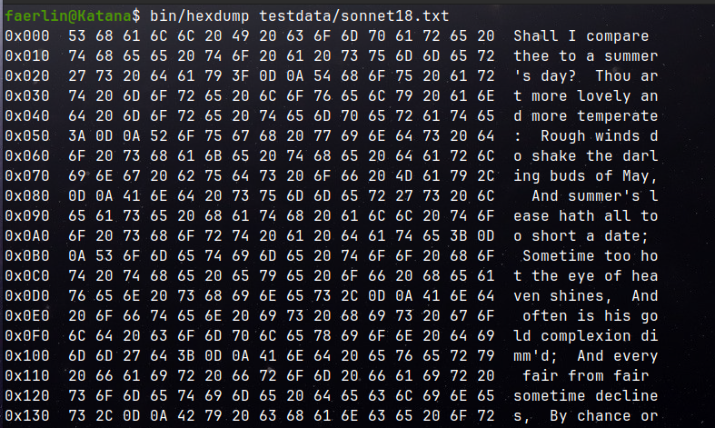

[![MIT License][license-shield]][license-url]
[![LinkedIn][linkedin-shield]][linkedin-url]

<div align="center">
    <h3 align="center">Hexdump</h3>
</div>

<details>
  <summary>Table of Contents</summary>
  <ol>
    <li>
      <a href="#about-the-project">About The Project</a>
    </li>
    <li>
      <a href="#getting-started">Getting Started</a>
      <ul>
        <li><a href="#prerequisites">Prerequisites</a></li>
        <li><a href="#build-and-running-the-application">Building and Running the Application</a></li>
      </ul>
    </li>
    <li><a href="#license">License</a></li>
  </ol>
</details>

## About The Project

<br/>
<div align="center">
    
    <br/>
    <figcaption>Figure 1. Output of the hexdump application on testdata/sonnet18.txt .</figcaption>
</div>
<br/>

Display the content of a file in hexadecimal, octal, or binary and optionally its ascii representation.

## Getting Started

To get a local copy up and running follow these simple steps.

### Prerequisites

The provided `Makefile` assumes the following tools to be already installed:

- `gcc`
- `make`

### Building and Running the Application

Build the executable `bin/hexdump` by running the `build` target of the `Makefile`.

```bash
$ make build
```

The usage of the `hexdump` application is given by

```bash
$ bin/hexdump FILE [OPTION]...
```

where the available options are as follows:

| Option | Default |                                                       |
|--------|---------|-------------------------------------------------------|
| `-a`   | No      | Abbreviate the output. Display the file content only. |
| `-h`   | Yes     | Display the content of the file in hexadecimal.       |
| `-o`   | No      | Display the content of the file in octal.             |
| `-b`   | No      | Display the content of the file in binary.            |

Sample run commands are given below.

```bash
$ bin/hexdump testdata           # print content in hexadecimal
$ bin/hexdump testdata -o        # print content in octal
$ bin/hexdump testdata -b        # print content in binary
$ bin/hexdump testdata -a        # abbreviate output
$ bin/hexdump testdata -ao       # abbreviate output and print content in octal
$ bin/hexdump testdata -ab       # abbreviate output and print content in binary
```

## License

Distributed under the MIT License. See `LICENSE.txt` for more information.

<!-- MARKDOWN LINKS & IMAGES -->
<!-- https://www.markdownguide.org/basic-syntax/#reference-style-links -->

[license-url]: LICENSE.txt

[linkedin-url]: https://www.linkedin.com/in/faerlin-pulido/

[license-shield]: https://img.shields.io/github/license/othneildrew/Best-README-Template.svg?style=for-the-badge

[linkedin-shield]: https://img.shields.io/badge/-LinkedIn-black.svg?style=for-the-badge&logo=linkedin&colorB=555
